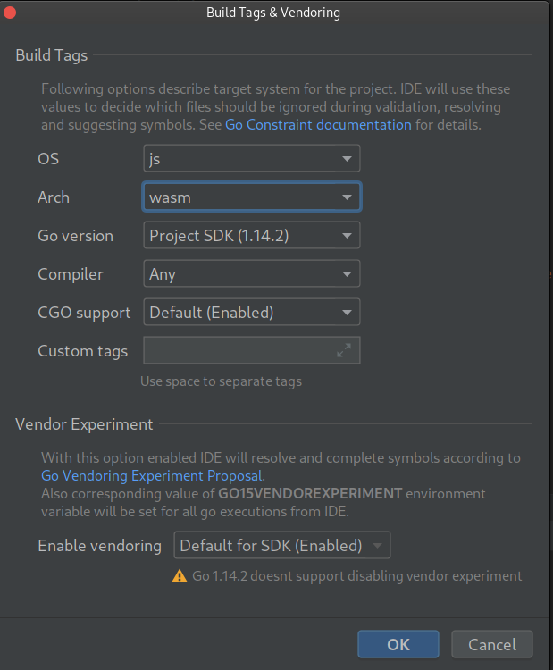

# Isogo

Have you ever wanted a modern Go frontend?

But the idea of using Go's Wasm compiler with all of its bulk turns you off. 
(Those massive .wasm file sizes are in double-digit megabytes.)

And you would use TinyGo, but you feel uncomfortable setting up the boilerplate and 
the idea of moving forward from there scares you because you're not sure when compatibility will break 
(if TinyGo doesn't compile a certain "thing" correctly).

## Isogo is a hot reloading TinyGo (with Go fallback) boilerplate setup with React and Material-UI 
   already installed and in use for you.

## Arch Linux Getting Started
The tinygo packages on AUR were not working for me, so I build it from source.

- [ ] plug in all the case fans on your PC.  This is a heavy lift.
- [ ] git https://github.com/tinygo-org/tinygo.git

      ```
      cd tinygo
      git submodule update --init
      make llvm-source
      export GO111MODULE=on
      export CC=clang
      export CXX=clang++
      make llvm-build
      make
      ldd ./build/tinygo
      make wasi-libc
      ```
      
      At this point you can either update your path to the location of tinygo/build or just copy /build/tinygo to 
      /usr/bin/ as root
      ```
      cd tinygo/build
      sudo cp tinygo /usr/bin/tinygo
      ```
- [ ] make build
- [ ] Launch a webserver that loads index.html and bob's your uncle! (this can be improved)

## Intellij with go plugin (should be the same for go-land)

